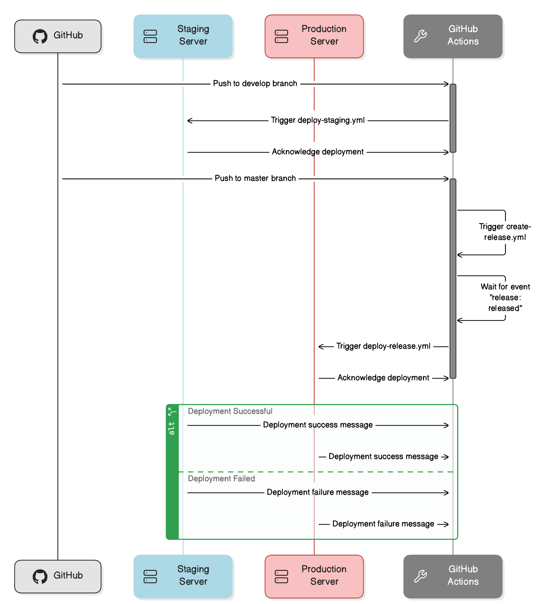

<p align="center">
    <br>
    <a href="https://wayof.dev" target="_blank">
        <picture>
            <source media="(prefers-color-scheme: dark)" srcset="https://raw.githubusercontent.com/wayofdev/.github/master/assets/logo.gh-dark-mode-only.png">
            
        </picture>
    </a>
    <br>
</p>

<p align="center">
    <strong>Build</strong><br>
    <a href="https://actions-badge.atrox.dev/wayofdev/laravel-starter-tpl/goto" target="_blank"></a>
    <a href="https://github.com/wayofdev/laravel-starter-tpl/actions/workflows/deploy-staging.yml?query=workflow%3ADeploy" target="_blank"></a>
    <a href="https://github.com/wayofdev/laravel-starter-tpl/actions/workflows/deploy-release.yml?query=workflow%3ADeploy" target="_blank"></a>
</p>
<p align="center">
    <strong>Project</strong><br>
    <a href="https://github.com/wayofdev/laravel-starter-tpl" target="_blank"></a>
    <a href="https://github.com/wayofdev/laravel-starter-tpl" target="_blank"></a>
    <a href="https://github.com/wayofdev/laravel-starter-tpl" target="_blank"></a>
</p>
<p align="center">
    <strong>Quality</strong><br>
    <a href="https://app.codecov.io/gh/wayofdev/laravel-starter-tpl" target="_blank"></a>
    <a href="https://dashboard.stryker-mutator.io/reports/github.com/wayofdev/laravel-starter-tpl/develop" target="_blank"></a>
    <a href=""></a>
</p>
<p align="center">
    <strong>Community</strong><br>
    <a href="https://discord.gg/CE3TcCC5vr" target="_blank"></a>
    <a href="https://x.com/intent/follow?screen_name=wayofdev" target="_blank"></a>
</p>
<br>

# Laravel Starter Template

This is an **opinionated** modified version of the Laravel framework which aims at providing a Domain-Driven Design (DDD) structure.

## 📄 About

Laravel is a popular PHP web framework that provides an easy and efficient way to build web applications. However, the default structure of Laravel, coupled with Eloquent's active record pattern, may not always fit the needs of a project that requires a Domain-Driven Design (DDD) architecture. Eloquent's active record pattern breaks DDD principles and make it difficult to separate your business logic from your infrastructure code.

This repository provides a modified file structure for Laravel that follows DDD principles and tries to adhere to best practices, such as those outlined in Spatie's Laravel Beyond CRUD. The goal is to provide a starting point for building Laravel applications using a DDD approach, while still leveraging the power and convenience of the Laravel framework.

<br>

🙏 If you find this repository useful, consider giving it a ⭐️. Thank you!

<br>

## 🚀 Features

This starter template includes several added, changed, and removed features:

### → Framework Modifications

* **Added:**
  * Strict types declaration in all PHP files
  * Application dockerization using docker-compose and Makefile — use `make help` to view available commands
  * [spatie/laravel-route-attributes](https://github.com/spatie/laravel-route-attributes) package for route definition using PHP8 style attributes

* **Changed:**
  * Marked default Laravel classes as `final`
  * Modified file structure to meet DDD principles (as close as possible)
  * Changed config folder files to use default PHP multi-line comment style

* **Removed:**
  * Dependencies like Laravel Sanctum, Laravel Pint, and Laravel Sail
  * Broadcasting service provider and its routes. It can be added back if required for the project
  * Console routes in favor of Command classes
  * Sanctum migration files

### → Development Tools

* **Added:**
  * Style checker package for custom rule-sets to php-cs-fixer — [wayofdev/php-cs-fixer-config](https://github.com/wayofdev/php-cs-fixer-config)
  * [Phive](https://github.com/phar-io/phive) support for managing PHP tools
    * [ergebnis/composer-normalize](https://github.com/ergebnis/composer-normalize) composer plugin for normalizing composer.json file
    * [maglnet/ComposerRequireChecker](https://github.com/maglnet/ComposerRequireChecker) to check whether a specific composer package uses imported symbols that aren't part of its direct composer dependencies
  * Application dockerization using docker-compose and Makefile — use `make help` to view available commands
    * [docker-php-dev](https://github.com/wayofdev/docker-php-dev) as PHP development environment with XDebug support out of the box

### → Testing

* **Added:**
  * Configured [PHPUnit](https://phpunit.de/index.html) for unit testing.
  * Integrated [Pest PHP](https://pestphp.com) for elegant console support and architecture testing.
  * [Infection](https://github.com/infection/infection) for mutation testing to ensure quality.
  * Mutation test reports are uploaded [Stryker Mutator Dashboard](https://dashboard.stryker-mutator.io).

### → Static Analysis

* **Added:**
  * Static analysis tool — [PHPStan](https://phpstan.org) and it's extensions:
    * [phpstan/extension-installer](https://github.com/phpstan/extension-installer) — automatic installation of PHPStan extensions
    * [phpstan/phpstan-deprecation-rules](https://github.com/phpstan/phpstan-deprecation-rules) — rules for detecting usage of deprecated classes, methods, properties, constants and traits.
    * [larastan/larastan](https://github.com/larastan/larastan) for Laravel-specific static analysis.
  * [Psalm](https://github.com/vimeo/psalm) static analysis tool and it's extensions:
    * [psalm/plugin-laravel](https://github.com/psalm/psalm-plugin-laravel) — Psalm plugin for Laravel
    * [psalm/plugin-phpunit](https://github.com/psalm/psalm-plugin-phpunit) — Psalm plugin for PHPUnit
  * [PHP Rector](https://github.com/rectorphp/rector) for automated code upgrades and refactoring, maintaining modern code standards.

### → Continuous Integration

* **Added:**
  * GitHub action workflows for:
    * Continuous integration which includes coding standards checks, unit testing and static analysis
    * Automatic pull-request labeling
  * Git pre-commit hooks using [pre-commit](https://pre-commit.com) package

### → Deployments

* **Added:**
  * [Deployer](https://deployer.org) for automatic deployments to staging and production servers with support of [GitHub Environments](https://docs.github.com/en/actions/deployment/targeting-different-environments/using-environments-for-deployment)
  * For more information see [Deployments](#-deployment-to-staging-and-production) section

<br>

## 🚩 Requirements

To use this repository, you need to meet the following requirements:

* **macOS** Monterey+ or **Linux**
* Docker 20.10 or newer
  * [How To Install and Use Docker on Ubuntu 22.04](https://www.digitalocean.com/community/tutorials/how-to-install-and-use-docker-on-ubuntu-22-04)
* **Cloned, configured and running** [docker-shared-services](https://github.com/wayofdev/docker-shared-services) to support system-wide DNS, routing, and TLS support via Traefik.

<br>

## 💿 Installation

> [!Note]
> You should configure, set up, and run the [docker-shared-services](https://github.com/wayofdev/docker-shared-services) repository to ensure system-wide TLS and DNS support.

1. **Clone** repository:

   After forking or creating generating repository from template, you can clone it to your local machine. In this example we will use `laravel-starter-tpl` repository as starting point.

   ```bash
   git clone git@github.com:wayofdev/laravel-starter-tpl.git
   ```

2. **Generate** `.env` file

   Generate .env file from .env.example file using Makefile command:

   ```bash
   $ make env \
       APP_NAME=laravel \
       SHARED_SERVICES_NAMESPACE=ss \
       COMPOSE_PROJECT_NAME=laravel-starter-tpl
   ```

   **Change** generated `.env` file to match your needs, if needed.

   (Optional): to re-generate `.env` file, add `FORCE=true` to the end of command:

   ```bash
   $ make env \
       APP_NAME=laravel \
       SHARED_SERVICES_NAMESPACE=ss \
       COMPOSE_PROJECT_NAME=laravel-starter-tpl \
       FORCE=true
   ```

3. **Build**, install and run. This will also generate Laravel app key:

   ```bash
   $ make

   # or run commands separately
   $ make hooks
   $ make install
   $ make key
   $ make prepare
   $ make up
   ```

<br>

## 🤖 Deployment to Staging and Production

This repository utilizes GitHub Actions for continuous deployment to both staging and production servers. Below is a description.

### → Deployment Flow

#### Deployment to Staging

1. **Push to `develop` branch**: Initiates the deployment process to the staging server. Merge PR against `develop` branch, to trigger `deploy-staging.yml`
2. **GitHub Actions**: Executes the `deploy-staging.yml` workflow.
3. **Staging Server**: Receives deployment instructions and acknowledges the deployment.

#### Deployment to Production

1. **Merge of `develop` branch into `master`**: Triggers the deployment process to the production server on push event.
2. **GitHub Actions**: Runs the `create-release.yml` workflow.
3. **Release Event**: `deploy-release.yml` waits for the event `release: released`.
4. **GitHub Actions**: Initiates the `deploy-release.yml` workflow.
5. **Production Server**: Receives deployment instructions and acknowledges the deployment.

#### Conditional Deployment Status

* **Deployment Successful**: Both staging and production servers send a success message back to GitHub Actions. Additionally, a success message is sent to the Slack server.

* **Deployment Failed**: If an error occurs, a failure message is sent back to GitHub Actions. Additionally, a failure message is sent to the Slack server.

#### Diagram



<br>

## 🧱 Credits and Useful Resources

Useful resources about Laravel and DDD approach:

* [Laravel Beyond CRUD](https://spatie.be/products/laravel-beyond-crud)

<br>

## 🔒 Security Policy

This project has a [security policy](.github/SECURITY.md).

<br>

## 🙌 Want to Contribute?

Thank you for considering contributing to the wayofdev community! We are open to all kinds of contributions. If you want to:

* 🤔 [Suggest a feature](https://github.com/wayofdev/laravel-starter-tpl/issues/new?assignees=&labels=type%3A+enhancement&projects=&template=2-feature-request.yml&title=%5BFeature%5D%3A+)
* 🐛 [Report an issue](https://github.com/wayofdev/laravel-starter-tpl/issues/new?assignees=&labels=type%3A+documentation%2Ctype%3A+maintenance&projects=&template=1-bug-report.yml&title=%5BBug%5D%3A+)
* 📖 [Improve documentation](https://github.com/wayofdev/laravel-starter-tpl/issues/new?assignees=&labels=type%3A+documentation%2Ctype%3A+maintenance&projects=&template=4-docs-bug-report.yml&title=%5BDocs%5D%3A+)
* 👨‍💻 Contribute to the code

You are more than welcome. Before contributing, kindly check our [contribution guidelines](.github/CONTRIBUTING.md).

[](https://conventionalcommits.org)

<br>

## 🫡 Contributors

<p align="left">
<a href="https://github.com/wayofdev/laravel-starter-tpl/graphs/contributors">

</a>
<br>
<br>
</p>

## 🌐 Social Links

* **Twitter:** Follow our organization [@wayofdev](https://twitter.com/intent/follow?screen_name=wayofdev) and the author [@wlotyp](https://twitter.com/intent/follow?screen_name=wlotyp).
* **Discord:** Join our community on [Discord](https://discord.gg/CE3TcCC5vr).

<br>

## ⚖️ License

[](./LICENSE.md)

<br>
